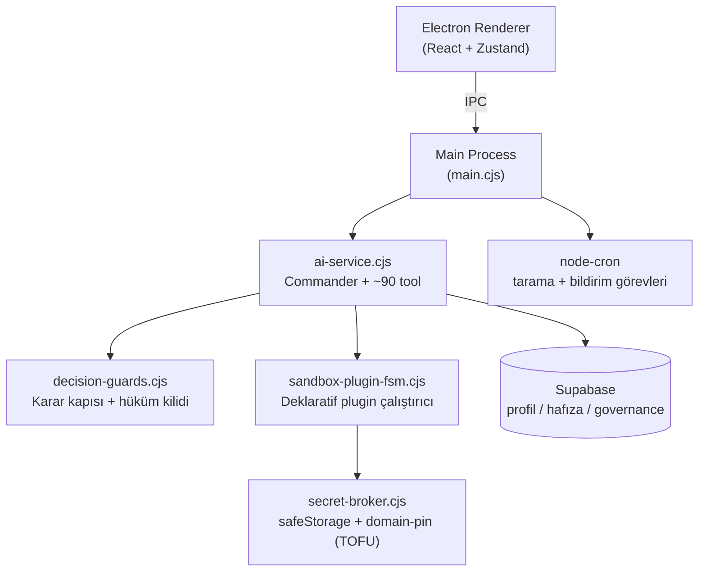

# 🐺 ÇAKAL — Kişisel Fırsat ve Araştırma Motoru

> Kurt gibi konuşur; sermayeye yaklaşırken liman başkanı gibi evrak ister.

ÇAKAL, tek kullanıcı için tasarlanmış, Electron tabanlı bir **kişisel yapay zekâ araştırma ve fırsat asistanıdır**. BIST, döviz, altın, kripto, emlak ve e-ticaret fırsatlarını çoklu kaynaktan araştırır; teknik görünüm, bilanço, haber akışı ve riskleri birlikte değerlendirir — ama yatırım kararını asla kullanıcının yerine vermez.

## Temel Felsefe

1. **Dili cesur, karar motoru muhafazakâr.** Yeterli kanıt (veri tazeliği + kaynak + değerleme + risk seviyesi) toplanmadan kesin AL/SAT hükmü üretilmez; yalnızca İNCELE / İZLE / RİSKLİ / VERİ YETERSİZ denebilir. Bu kural prompt'ta değil, deterministik **karar kilidi**nde yaşar.
2. **Kontrollü self-evolution.** Çakal eksik yeteneğini fark eder, tek kullanıcı onayıyla kendine yeni "organ" (sandbox plugin) takar — ama kendi omuriliğini (çekirdek kod, güvenlik katmanları) ameliyat edemez.
3. **LLM ham secret görmez.** API anahtarları Secret Broker'da şifreli durur; çalışma anında yalnızca plugin runner çözer.

## Öne Çıkan Yetenekler

- **Commander ajanı** — GPT tabanlı, görev tipine göre model yönlendiren (quick/chat/deep_analysis/code_gen) çok araçlı orkestra: ~90 tool (finans verisi, emlak, scraping, Telegram, öz-gelişim).
- **Otonom entegrasyon akışı (tek onay):** eksik yetenek tespiti → gap kaydı → öneri → kullanıcı onayı → plugin manifesti → Secret Broker'da hazır anahtar alanı → anahtar girilince otomatik test → hata varsa düzelt-tekrar dene döngüsü.
- **Sandbox Plugin FSM:** manifest tabanlı, deklaratif (yalnızca HTTPS GET) plugin çalıştırıcı. Serbest kod yürütme yok.
- **Karar korumaları:** karar kapısı (veri toplanmadan işlem hükmü yok), hüküm-kanıt kilidi, profil kurulum bağlam ayrımı.
- **Kişiselleştirme:** kullanıcı profili (risk toleransı, vade, maksimum kayıp), kalıcı hafıza (user index), strateji pattern çıkarımı.
- **Sesli asistan:** yerel VAD + STT/TTS, yankı önleme (dört katmanlı), token-ekonomik tasarım.
- **Aktivite Monitörü:** her ajan koşusunun tool çağrıları, kararlar ve kapı olayları gerçek zamanlı izlenir.

## Mimari



### Governance zinciri (self-evolution)

```
Eksik yetenek → capability_gaps → expansion_proposals → kullanıcı onayı
   → apply_capability_plan (governance kapısı: kayıt yoksa fail-closed)
   → sandbox dosyaları / plugin manifesti → otomatik test
   → çekirdeğe terfi = AYRI ikinci insan onayı (request_core_promotion)
```

## Güvenlik Modeli

| Katman | Kural |
|---|---|
| Yazma alanı | Yalnızca `.cakal-sandbox/` altı; çekirdek dizinler (electron/, src/, packages/, scripts/) LLM'e kapalı |
| Kod yürütme | Yok. Plugin'ler deklaratif HTTPS GET manifestleri; `node` yalnız sürüm + insan-yazımı `scripts/` |
| Secret'lar | safeStorage ile şifreli; LLM context'ine asla girmez; **TOFU domain-pin**: her anahtar ilk kullanıldığı host'a sabitlenir |
| HTTP | Redirect takip edilmez (sızıntı vektörü), yanıt boyutu sınırlı, local/private host engelli |
| Komutlar | Allowlist + blocklist (command-guard); zincirleme/eval kalıpları bloklu |
| Finans hükümleri | Deterministik karar kilidi; kanıt araçları çalışmadan AL/SAT çıkmaz |

## Kurulum

```bash
npm install
cp .env.example .env   # anahtarları doldur (OpenAI, Perplexity, Supabase, Telegram)
npm test               # 164 birim testi
cd apps/desktop && npm run dev
```

API anahtarları iki yerde yaşar: altyapı anahtarları `.env`'de, plugin anahtarları (ör. OpenWeather) uygulama içi **Ayarlar → Secret Broker**'da.

## Proje Yapısı

```
apps/desktop/
  electron/          # Main process: ajan, guard'lar, FSM, Secret Broker
  src/               # React renderer: Chat, Dashboard, Ayarlar, Sesli Asistan
packages/            # Paylaşılan çekirdek (ör. investment-research policy-core)
supabase/            # Şema migration'ları
tests/               # Vitest birim testleri (güvenlik yolları dahil)
docs/                # Denetim ve API notları
```

## Yol Haritası

- [ ] FSM genişlemesi: kontrollü POST, zincirli API çağrıları, JSON dönüşüm DSL'i
- [ ] Deterministik değerleme hesaplayıcı (F/K, PD/DD) — karar kilidine gerçek hesap beslemesi
- [ ] `ai-service.cjs` monolitinin modüllere bölünmesi
- [ ] MCP gateway: tool'ların policy kapısı arkasında dış ajanlara açılması
- [ ] Gerçek kod yürütme ihtiyacı doğarsa: izole executor (container/WASM) — o güne kadar deklaratif kalır

---

*Tasarım ve ürün sahibi: Emrah Badaş — uzakyol gemi kaptanı.*
*Geliştirme: Claude (Anthropic) eşliğinde yapay zekâ destekli oturumlar.*
