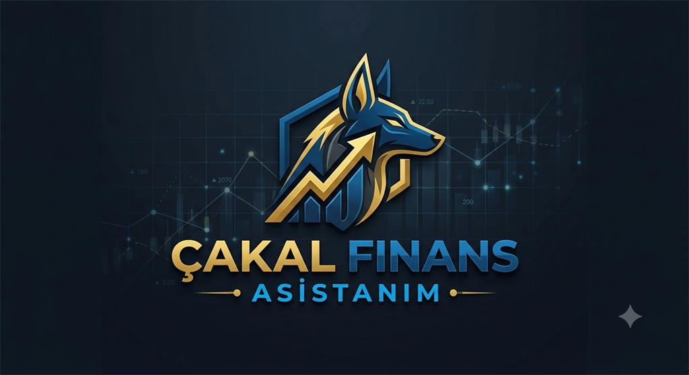
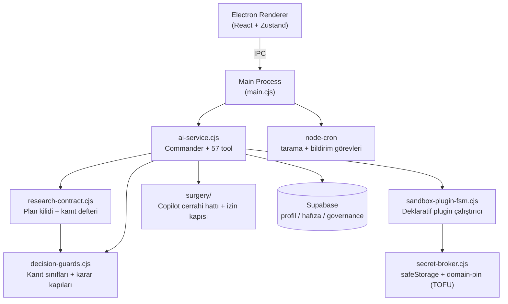

# 🐺 ÇAKAL — Kişisel Fırsat ve Araştırma Motoru

<p align="center">
  
</p>

> Kurt gibi konuşur; sermayeye yaklaşırken liman başkanı gibi evrak ister.

ÇAKAL, tek kullanıcı için tasarlanmış, Electron tabanlı bir **kişisel yapay zekâ araştırma ve fırsat asistanıdır**. BIST, döviz, altın, kripto, emlak ve e-ticaret fırsatlarını çoklu kaynaktan araştırır; teknik görünüm, bilanço, haber akışı ve riskleri birlikte değerlendirir — ama yatırım kararını asla kullanıcının yerine vermez.

## Çakalın Doğası

Çakal olmak şunu gerektirir: fırsatın kokusunu uzaktan almak, ama kokuyu kanıt sanmamak. Kalabalığın koştuğu yöne bakmak, ama sürüyle birlikte düşünmeden koşmamak. Gerektiğinde cesur olmak; cesareti kibirle, ihtiyatı korkaklıkla karıştırmamak.

Aslan fazla özgüvenlidir: gücüne inanır, geri çekilmeyi yenilgi sayar. Tavşan her harekette tehdit görür: tehlikeden kaçarken fırsatı da geride bırakır. Piyasa ikisini de sınar — kibri cezalandırır, korkuyu maliyete dönüştürür.

Çakal başka türlü hareket eder. En güçlü olmaya değil, en uyanık kalmaya çalışır. Gürültüye değil, ize bakar. Fiyatın yükselmesini değer, düşmesini fırsat sanmaz. Önce bilginin kaynağını, verinin tazeliğini, kârın kalitesini ve riskin büyüklüğünü sorgular. Kalabalığın ne düşündüğünü izler; kararını kalabalığa teslim etmez.

Çünkü borsada iyi bir şirket, her fiyattan iyi bir yatırım değildir. Güçlü bir bilanço, beklenti önceden satın alınmışsa yeni bir fırsat yaratmaz. Ucuza düşmüş görünen bir hisse, gerçekten değersizleşiyor olabilir. Çakal bu ayrımı yapmadan saldırmaz.

Fırsat varsa yaklaşır. Kanıt varsa değerlendirir. Risk karşılanmıyorsa geri çekilir. Tezi bozulduğunda gurur yapmaz; çünkü piyasada hayatta kalmak, haklı görünmekten daha değerlidir.

Çakalın disiplini basittir:

- Fırsatın varlığı yetmez; yanlış fiyatlanmış olması gerekir.
- Koku alınabilir; karar kanıtla verilir.
- Getiri kadar kaybın büyüklüğü ve kaçış yolu da ölçülür.
- Kalabalık izlenir, körü körüne takip edilmez.
- Veri yetersizse hüküm üretilmez.
- Tez bozulursa pozisyona sadakat gösterilmez.
- Tek fırsat uğruna sermayenin geleceği riske atılmaz.
- Büyük kazançtan önce hayatta kalmak gelir.

Bu depodaki her karar kapısı — fiyatlanma kilidi, hüküm-kanıt kilidi, risk eşikleri, VERİ YETERSİZ hükmü — bu doğanın koda dökülmüş hâlidir. ÇAKAL bu yüzden kullanıcı adına karar veren bir kehanet makinesi değildir: fırsatı arayan, kanıtı sorgulayan, ters tezi dinleyen ve belirsizlik karşısında sınırını bilen bir araştırma motorudur.

**ÇAKAL — fırsatı koklar; kanıtı görmeden ısırmaz.**

## Temel Felsefe

1. **Dili cesur, karar motoru muhafazakâr.** Yeterli kanıt (veri tazeliği + kaynak + değerleme + risk seviyesi) toplanmadan kesin AL/SAT hükmü üretilmez; yalnızca İNCELE / İZLE / RİSKLİ / VERİ YETERSİZ denebilir. Bu kural prompt'ta değil, deterministik **karar kilidi**nde yaşar.
2. **Beyan kanıt değildir.** "Yaptım" demek, "ölçtüm" demek ve kelimenin cevapta geçmesi — üçü de kanıt sayılmaz. Her kapı gerçek araç provenance'ına bakar: hangi araç, hangi sembol için, hangi kanıt sınıfını, ne zaman üretti.
3. **Eksik kanıt cevabı susturmaz, hükmü sınırlar.** Bir katman eksikse tüm araştırma çöpe gitmez; yalnız o katmana dayanan iddia bloke edilir, gerisi güven notuyla sunulur.
4. **Kontrollü self-evolution.** Çakal eksik yeteneğini fark eder, tek kullanıcı onayıyla kendine yeni "organ" (sandbox plugin) takar — ama kendi omuriliğini (çekirdek kod, güvenlik katmanları) ameliyat edemez.
5. **LLM ham secret görmez.** API anahtarları Secret Broker'da şifreli durur; çalışma anında yalnızca plugin runner çözer.

## Öne Çıkan Yetenekler

- **Commander ajanı** — GPT tabanlı, görev tipine göre model yönlendiren (quick/chat/deep_analysis/code_gen) çok araçlı orkestra: 57 tool (finans verisi, emlak, scraping, Telegram, öz-gelişim, cerrahi hat).
- **Otonom entegrasyon akışı (tek onay):** eksik yetenek tespiti → gap kaydı → öneri → kullanıcı onayı → plugin manifesti → Secret Broker'da hazır anahtar alanı → anahtar girilince otomatik test → hata varsa düzelt-tekrar dene döngüsü.
- **Sandbox Plugin FSM:** manifest tabanlı, deklaratif (yalnızca HTTPS GET) plugin çalıştırıcı. Serbest kod yürütme yok.
- **Araştırma sözleşmesi:** karmaşık finans sorularında yürütmeden önce kilitlenen, makine tarafından denetlenen kanıt planı (aşağıda ayrı bölüm).
- **Karar korumaları:** karar kapısı, hüküm-kanıt kilidi, fiyatlanma kilidi, seviye provenance kilidi, yönetilmemiş sıralama kapısı — hepsi araç provenance'ına bakar, cevap metnindeki kelimeye değil.
- **Cerrahi bakım hattı:** kaynak kod değişikliği talebi GitHub Copilot ajanına devredilir; izin kapısı iki katmanlıdır (sert red katmanı hiç sorulmaz, onay katmanı kartla sorulur) ve iki ayrı onay düzlemi vardır — "worktree'ye yazayım mı" ile "canlı koda insin mi" karıştırılmaz.
- **Kişiselleştirme:** kullanıcı profili (risk toleransı, vade, maksimum kayıp), kalıcı hafıza (user index), strateji pattern çıkarımı.
- **Sesli asistan:** yerel VAD + STT/TTS, yankı önleme (dört katmanlı), token-ekonomik tasarım.
- **Aktivite Monitörü:** her ajan koşusunun tool çağrıları, kararlar ve kapı olayları gerçek zamanlı izlenir.

## Araştırma Sözleşmesi

Finans tarafındaki en büyük soru şuydu: model doğru araçları çalıştırdı mı? Yanlış soru. Doğrusu: **hangi iddia hangi kanıtla destekleniyor?**

`research-contract.cjs`, mevcut `execution-contract.cjs`'in (kod görevleri için plan → uygula → geri oku → karşılaştır → düzelt) finans ikizidir. Strateji ayrı bir ajan **değildir** — muhakemeyi yine model yapar, modül onu denetlenebilir kılar. *Stratejist düşünür, sözleşme düşündüğünü kilitler.*

```
Karmaşık istek → submit_research_plan (KİLİTLENİR)
   → kanıt topla → kanıt defterinden kapsam hesapla
   → eksikse HEDEFLİ onarım (sınıfı üreten aracı adıyla iste)
   → alt soru bazında COMPLETE / PARTIAL / BLOCKED
```

**Üç sert kural**

1. `requiredEvidence` yalnız bir aracın **gerçekten ürettiği** sınıflardan seçilebilir. Üreticisi olmayan sınıf (ör. endeks ağırlığı) plan sunulurken reddedilir — yoksa o alt soru sonsuza kadar bloke kalır ve sözleşme duvara döner.
2. Kanıt sınıfı kilitli, kanıta giden **yol serbest**. Kaynak erişilemezse `amend_research_plan` fallback ekler; zorunlu kanıtı kaldıramaz. Çıta indirilemez.
3. Tamamlanma **kanıt defterinden** hesaplanır, modelin beyanından değil.

**Alt sorular çıktı türüne göre ayrışır** — "amiral gemisi" ile "bugün alınabilir" farklı sorulardır ve bir şirket birinci listede olup üçüncüde olmayabilir; bu çelişki değildir:

| outputKind | Zorunlu asgari kanıt |
|---|---|
| `structural_leader` | endeks üyeliği + likidite |
| `current_leader` | güncel fiyat + teknik sinyal |
| `investable_candidate` | temel + **değerleme** + fiyat + piyasa seansı |

Ham mali tablo (`FUNDAMENTALS`) değerleme (`VALUATION`) **değildir**; ikisi ayrı sınıftır ve ayrı üreticileri vardır.

**Kapı dispatcher seviyesindedir**, tool listesinde değil. Plan yoksa kanıt üreten hiçbir araç çalışmaz. (Bir tool olarak sunulan önceki politika katmanı, model onu çağırmadığında hiç çalışmıyordu.)

**Koşullu tetiklenir.** "THYAO kaç TL?" için plan kurmak israftır. Deterministik karmaşıklık skoru ≥ 4 olduğunda devreye girer: çoklu şirket, sıralama, işlem kararı, piyasa geneli, çoklu zaman ufku, portföy.

### Kanıt Defteri

Her araç çalıştığında yapılandırılmış kayıt tutulur — performans ölçümünden (`_toolTimings`) tamamen ayrı, çünkü biri hızı diğeri epistemik durumu izler:

```
{ researchRunId, tool, entity, evidenceClass, asOf, retrievedAt, universeScope }
```

- **Entity boyutu zorunlu.** THYAO için çekilen fiyat, KCHOL hakkındaki alt soruyu tatmin etmez. `coverage: ALL` ile üç hisselik karşılaştırmada tek hissenin verisi yetmez.
- **Sınıf başına TTL.** Fiyat 15 dk, teknik 1 saat, bilanço 90 gün. Tek bir tazelik kuralı her kanıta uygulanamaz.
- **Kapsam bir kullanıcı isteğidir.** Onarım turları aynı planı ve birikimli defteri paylaşır; yeni istek yeni koşu açar — eski kanıt yeni soruyu sessizce tatmin edemez.
- **Benchmark ayrı.** XU100 şirket entity'si değildir (likidite/bilanço istenmez) ama "XU100'e göre +%6,7" iddiası endeks serisi olmadan kurulamaz.

## Mimari



### Finans veri kaynakları

| Kaynak | Ne verir | Not |
|---|---|---|
| Mynet canlı borsa (`get_bist_board`) | Tek istekte 628 enstrüman: fiyat, %değişim, hacim, işlem hacmi (TL), XU030/XU050/XU100 **üyeliği**, seans durumu | Gecikmeli. Üyelik ağırlık değildir |
| Yahoo Finance | Teknik seri: MA, çok dönemli getiri, volatilite | `dailyChangePercent` pencereden bağımsız; `volatility` günlük getiri std sapması, `rangeWidthPercent` ayrı alan |
| İş Yatırım MaliTablo | Bilanço + gelir tablosu; sektör adaptörleri (sanayi/banka/sigorta/holding/GYO) | Sektör satırın **varlığına** değil önemliliğine bakar |
| `get_valuation_multiples` | Değerleme girdileri (net kâr, özkaynak, güncel fiyat, dönem) | `VALUATION` sınıfının tek üreticisi |
| Perplexity (`verify_claim`) | Destekleyici / çürütücü / uzman kanıtı | Alan adı bazında tekilleştirilir; kaynak sayısı ≠ iddia güveni |

**Piyasa seansı bir kanıt sınıfıdır.** Seans Europe/Istanbul'a göre hesaplanır (makine saati ≠ borsa saati). Resmî tatil takvimi doğrulanmadığı için belirli gün adı verilmez; "bir sonraki açık BIST seansı" denir.

### Governance zinciri (self-evolution)

```
Eksik yetenek → capability_gaps → expansion_proposals → kullanıcı onayı
   → apply_capability_plan (governance kapısı: kayıt yoksa fail-closed)
   → sandbox dosyaları / plugin manifesti → otomatik test
   → çekirdeğe terfi = AYRI ikinci insan onayı (request_core_promotion)
```

## Güvenlik Modeli

| Katman | Kural |
|---|---|
| Yazma alanı | Yalnızca `.cakal-sandbox/` altı; çekirdek dizinler (electron/, src/, packages/, scripts/) LLM'e kapalı |
| Kod yürütme | Yok. Plugin'ler deklaratif HTTPS GET manifestleri; `node` yalnız sürüm + insan-yazımı `scripts/` |
| Secret'lar | safeStorage ile şifreli; LLM context'ine asla girmez; **TOFU domain-pin**: her anahtar ilk kullanıldığı host'a sabitlenir |
| HTTP | Redirect takip edilmez (sızıntı vektörü), yanıt boyutu sınırlı, local/private host engelli |
| Komutlar | Allowlist + blocklist (command-guard); zincirleme/eval kalıpları bloklu |
| Finans hükümleri | Deterministik karar kilidi; taze kanıt olmadan AL/SAT çıkmaz. Kapı araç **adına** değil kanıt **sınıfına** ve yaşına bakar |
| Fiyat seviyeleri | Somut giriş/stop rakamı ancak o sembolde ölçüm kanıtı varsa geçer; sayı üretmek ölçüm yapmak değildir |
| Kaynak kodu | LLM yazamaz; talep cerrahi hatta devredilir, değişiklik worktree'de üretilir, preflight kapısı BLOCK derse kullanıcı onayı geçersizdir |

## Kurulum

```bash
npm install
cp .env.example .env   # anahtarları doldur (OpenAI, Perplexity, Supabase, Telegram)
npm test               # 866 birim testi (65 dosya)
cd apps/desktop && npm run dev
```

API anahtarları iki yerde yaşar: altyapı anahtarları `.env`'de, plugin anahtarları (ör. OpenWeather) uygulama içi **Ayarlar → Secret Broker**'da.

## Proje Yapısı

```
apps/desktop/
  electron/          # Main process: ajan, guard'lar, FSM, Secret Broker
    research-contract.cjs   # Plan kilidi, kanıt defteri, hedefli onarım
    decision-guards.cjs     # Kanıt sınıfları, TTL, karar kapıları
    execution-contract.cjs  # Kod görevleri için plan→doğrula döngüsü
    earnings-pricing.cjs    # Bilanço–fiyat köprüsü (fiyat uzaması ölçümü)
    surgery/                # Copilot cerrahi hattı + izin kapısı
  src/               # React renderer: Chat, Dashboard, Ayarlar, Sesli Asistan
packages/            # Paylaşılan çekirdek (ör. investment-research policy-core)
supabase/            # Şema migration'ları
tests/               # Vitest birim testleri (güvenlik yolları dahil)
docs/                # Denetim ve API notları
```

## Yol Haritası

> Kapanmayan işler ve **canlıda doğrulanmayı bekleyen** değişiklikler:
> [docs/acik-isler-ve-dogrulama.md](docs/acik-isler-ve-dogrulama.md)

### Deterministik aday hunisi

Aday seçimi koda alınır; model hiçbir kademede sembol seçmez, yalnız çıkan tabloyu yorumlar. Kademeler: istek kapısı → evren → uygunluk → ucuz ön tarama → araştırma havuzu → derin araştırma → nihai kapı → raporlama.

Tasarım kararları: nihai listede **kota doldurma yok** (iki aday geçtiyse iki tane döner, hiçbiri geçmezse `NO_CANDIDATE` geçerli sonuçtur); temel analiz nihai seçimden **önce** çalışır (yoksa seçimi teknik belirler); veri yokluğu kalite hükmünden **ayrı** raporlanır (kaynak limiti "kötü şirket" demek değildir).

- [x] Huni sözleşmesi (`candidate-funnel.cjs`) — kademe grameri, elenme gerekçe kodları, soy zinciri, `CANDIDATE_FUNNEL` kanıt nesnesi, "model listeyi değiştiremez" kapısı. Eşik İÇERMEZ (bilerek).
- [x] **Adım 1 — Entity kapsamı:** `web_search` / `search_youtube_insights` / `verify_claim` sembolü `query` metninde taşıyor, kanıt olayları entity'siz yazılıyordu → sözleşme o şirketleri hiç göremiyor, alt soru BLOCKED kalıyordu (`bist-entity-resolver.cjs`)
- [x] **Adım 2 — Sonuç-duyarlı kanıt sınıfı:** `resolveEvidenceClasses(toolName, event)` üç kademeli karar verir — önce başarısızlık/`BLOCKED` elenir, sonra olayın KENDİ `evidenceClasses` beyanı okunur (boş dizi geçerli bir "kanıt yok" beyanıdır), en son statik tabloya düşülür. Hem kanıt defteri hem sözleşmenin `record()` yolu buradan geçer; sıralama kapısı da artık "araç çalıştı" yerine "araç kanıt üretti" sorar. Ölçülen eski davranış: `status:'BLOCKED'` dönen bir tarama üç kanıt sınıfı basıp entity'yi kanıtlı sayıyor ve yönetilmiş sıralama kapısını açıyordu. **`CANDIDATE_FUNNEL` artık statik tabloya eklenebilir.**
- [x] **Adım 3 — Sözleşme kapanışı artık hükmü indiriyor:** kapanış tam değilse (`status !== COMPLETE`) ve cevapta hüküm satırı varsa `neutralizeEquityVerdicts` rapor EKLENMEDEN ÖNCE uygulanır — AL→İNCELE, SAT→RİSKLİ; nitel bulgular olduğu gibi kalır. Muhasebe de düzeldi: `partialIds` ve `unresolvedIds` eklendi, PARTIAL alt sorular artık hiçbir listeye düşmemekten kurtuldu (`answerable + partial + blocked = toplam`, testle sabit). Rapor notu yalnız BLOCKED'a değil tam olmayan HER alt soruya çıkıyor; monitör satırı da "tam / kısmi / bloke" olarak üçe ayrıldı. Nihai çözüm (composer'ın kapsamı cevap üretmeden ÖNCE alması) hâlâ açık — bkz. cevap sonrası tutanak maddesi. ESKİ HÂLİ: kapanış raporu cevabın altına *ekleniyor*, üstteki model hükmüne dokunulmuyor; aynı cevapta "sosyal kanıtı kapattım" ile "sosyal kanıt BLOCKED" yan yana durabiliyor. `neutralizeEquityVerdicts` zaten var, kapanışa bağlanacak. İki regresyon testi: (a) AL/SAT nötrleşiyor mu, (b) bloke alt soruya ait **nitel** hüküm ("haber akışı kirli", "spek doğası baskın") kalıyor mu — kalıyorsa nihai çözüm composer'ın `coverage.answerableIds/blockedIds` bilgisini cevap üretmeden ÖNCE alması
- [x] **Adım 4 — Volatilite semantiği tekleştirildi:** ayrışmanın sebebi eşik değil **birimdi**. `policy-core.cjs` (v2.1.0) artık `VOLATILITY_UNIT = 'DAILY_RETURN_STDDEV_PCT'`, `VOLATILITY_CAPS {low:3, medium:5, high:8}` ve `resolveVolatilityCap()` ile tek doğruluk kaynağı; core'un `DEFAULT_SCREENING_CONFIG` ve canlı taraf ikisi de buradan besleniyor (canlıdaki inline 3/5/8 kaldırıldı, `deterministic-agents.cjs`'teki köprü deseni + fallback kullanıldı). Taşıma sırası README'nin uyardığı gibi yapıldı: **önce doğru semantik core'a**, sonra canlı ona yönlendirildi. Eski test fixture'ı da eski birimde yazılmıştı (18/42 → 2.4/9) ve taşındı. Eşdeğerlik testi hem 35'e dönüşü hem fallback drift'ini yakalıyor. KALAN: `runInvestmentScreening` hâlâ canlı hattan çağrılmıyor — skorlayıcı gövdelerinin birleştirilmesi Adım 5 ile birlikte yapılacak. ESKİ HÂLİ: core'daki `runInvestmentScreening` hiç çağrılmıyor, canlı tarafta ayrı skorlayıcılar var; ikisi aynı koşula zıt etiket veriyor (core `SCREENING_READY` ↔ canlı `PARTIAL_RESEARCH`). DİKKAT: core `maximumVolatility: 35` ile **eski aralık-genişliği** semantiğinde; canlı taraf 2026-08-09'da std-sapma + 3/5/8'e düzeltildi. Önce doğru semantik core'a taşınacak, sonra canlı core'a yönlendirilecek — tersi eski hatayı sessizce diriltir
- [~] **Adım 5 — Huni entegrasyonu (kademe 0 bitti, 5–7 açık):** `buildFunnelRequestGate(complexity, { freshMarketScan, namedSymbolCount })` kademe 0'ı mevcut `requiresResearchContract` skoruna bağlıyor — **yeni sınıflandırıcı yazılmadı**, skor orada hesaplanıp burada yorumlanıyor. Üç karar: `OPEN` / `SKIP_USER_SCOPED` / `SKIP_NOT_SCREENING`. Kullanıcının adıyla verdiği semboller (mesajda **veya devralınan kapsamda**) huni açtırmaz — evren yoksa aday seçimi de yoktur. Yan bulgu: `isCommanderFreshMarketScanRequest` "piyasayı sıfırdan tara ve aday çıkar" gibi ders kitabı taleplerini finans sözlüğüne takıldığı için reddediyordu; tarama kalıbı artık kendi başına piyasa bağlamı sayılıyor.
  **KALAN:** kademe 5–7 (DEEP_RESEARCH, FINAL_GATE) canlı tarayıcıda yok — `run_investment_research_scan` charter→evren→eleme yapıp `nextRequiredStates` ile derin kademeleri devrediyor. Huni sözleşmesi `FINAL_GATE`'e ulaşmayan huniyi doğru şekilde `BLOCKED` sayıyor, bu yüzden **`CANDIDATE_FUNNEL` hâlâ `TOOL_EVIDENCE_CLASSES`'e EKLENMEDİ**: üretilemeyen bir sınıfı plana açmak kapanamayan duvar üretir. Derin kademeler gelince sınıf kaydedilecek

Bekleyen önkoşullar: KAP adaptörü (`packages/sources/kap`) yazılmış ama Commander aracı olarak bağlı değil — katalizör kademesi ona muhtaç. `evidenceConfidence` şu an sabit (`success ? 0.78 : 0.35`), gerçek ölçüm olmadan `dataConfidence` kapısı ayırt etmez. Eşik kalibrasyonu için geriye dönük test motoru yok (`backtests/` altında yalnız örnek JSON).

### Diğer

- [ ] **Kaynak otorite katmanı:** alan adı tekilleştirmesi var, otorite derecesi ve ortak köken tespiti yok — 31 farklı alan adı hâlâ 31 bağımsız kaynak demek değil
- [ ] **Seviye türetimi:** kapı şu an "o sembolde ölçüm var mı" soruyor; "bu rakam o ölçümden mi türedi" sormuyor
- [ ] **Sesli asistan — konuşma dışı ses:** süre kapısı tek öksürüğü eliyor; sürekli ritmik gürültü (masa tempo) hâlâ STT'ye gidiyor. Alt bant enerji oranı denendi ve ölçümle çürütüldü (konuşma 0.17, gürültü 0.07–0.30 — ayırmıyor). Gerçek çözüm periyodiklik/perde tespiti
- [x] Değerleme girdileri (`get_valuation_multiples`) — net kâr/özkaynak artık gerçekten çıkarılıyor. İki bağımsız kusur vardı: aranan anahtar adları (`netKar`, `ozkaynak`) kalem tablosunda hiç tanımlı değildi (gerçekleri `netDonemKari`, `ozkaynaklar`), ve sektör argümanı geçilmediği için UFRS/UFRS_K gruplarında adaptör BANK'a düşüyordu. Hisse adedi gerektiren **mutlak** çarpanlar (F/K, PD/DD) hâlâ üretilmiyor — bu bilinçli, veri güvenilir değil
- [x] **Sözleşme kapsamı konuşmadan devralınır:** `createResearchRun({ priorEntities })` → `requiresResearchContract(message, { priorEntities })`. **KAPSAM taşınır, KANIT taşınmaz** — hangi şirketler konuşuluyor bilgisi devreder, hangi ölçümler elde var bilgisi her istekte sıfırdan toplanır. Mesaj kendi sembolünü söylüyorsa devralma yapılmaz (kullanıcı kapsamı yeniden çizmiştir); devralma tek başına yetmez, yanına işlem/karşılaştırma/sıralama niyeti şart. Ayrıca `COMMANDER_FINANCE_DOMAIN_RE`'ye temel analiz sözlüğü (bilanço, mali tablo, değerleme, temettü, özkaynak, net borç, F/K, PD/DD, FAVÖK) ve `TICKER_STOPWORDS`'e döviz pariteleri eklendi. Ölçülen: "bilanço + fiyatlama karşılaştırması da yap" skor 0 → **skor 4, `coklu sirket (2, baglamdan)`**
- [x] **Onarım turları kalıcı geçmişten ayrıldı:** `chat(msg, { internalTurn: true })` — kapı yeniden denemeleri artık yalnız istek-içi `workingHistory` üzerinde yaşar; ne onarım metni `role:'user'` olarak, ne de doğrulanmamış ara cevap kalıcı geçmişe girer. main.cjs'teki altı kapı çağrısının hepsi bu bayrağı geçiyor, nihai metin kapılar yerleştikten sonra `commitConversationTurn(response)` ile bir kez yazılıyor (ikinci commit öncekini ezer). Böylece bir kullanıcı isteği geçmişte 6 slot değil 2 slot yer kaplıyor. ESKİ HÂLİ: her kapı yeniden denemesi (`[ÇEKİRDEK ZORUNLULUK — ...]`) `role:'user'` olarak kalıcı `conversationHistory`'ye giriyor. Geçmiş son 16 mesaja kırpıldığı için kapı ateşleyen tek tur 6 slot yiyor ve gerçek konuşma ~2,5 turda pencereden düşüyor. Onarım geçici bir `workingHistory` üzerinde yaşamalı; kalıcı geçmişe yalnız nihai cevap yazılmalı
- [x] **Action ledger artık ne çektiğini saklıyor:** `distillToolFacts` her araç sonucundan dönem, dönem listesi, `asOf`, fiyat/net kâr/özkaynak, sınıflandırma, `EKSİK_GİRDİ` ve `BULUNAMADI` alanlarını çıkarıp kayda yazıyor. Durum etiketi de üçe ayrıldı: `OK` / `KISMİ` / `BLOKE` / `HATA` — eksik girdiyle dönen araç artık "OK" diye kaydedilmiyor (başarısızlık tanımı kanıt defteriyle aynı `FAILED_RESULT_STATUSES` kümesinden geliyor). Kayıt başlığı modele açıkça "KISMİ/BLOKE araçlarda hüküm kurma" diyor. ESKİ HÂLİ: `sanitizeConversationHistory` tool mesajlarını siliyor, yerine geçen `buildActionLedger` yalnız araç adı + `OK`/`HATA` yazıyor. Dönem, `asOf`, değerler, eksik girdiler kayboluyor; model sonraki turda kendi anlatısına çıpa atıyor. (`OK`/`HATA` yalanı Adım 2 ile kısmen kapandı, içerik hâlâ yok)
- [x] **Mali tablo dönem penceresi düzeltildi:** 45 günlük varsayım kaldırıldı — pencere artık en güncel KAPANMIŞ çeyrekten başlıyor ve `fetchCompanyFinancials` boş dönerse geriye kayıyor (ileriden geriye prob, en fazla iki kayma). 11 Ağustos 2026'da pencere `2026/3` yerine **`2026/6`** ile başlıyor; BRSAN'ın 7 Ağustos'ta yayımladığı çeyrek artık görülüyor. YoY için `sameQuarterAcrossYears` ile AYRI istek atılıyor (`2026/6, 2025/6, 2024/6, 2023/6`); başarısızlığı ana tabloyu düşürmüyor ve sonuç `yoyAvailable` + `yoyNote` ile raporlanıyor — cevap artık "veri yok" değil "aracım o kolonu getiremedi" demek zorunda. ESKİ HÂLİ: `lastReportedQuarters` "dönem kapanışı + 45 gün" varsayıyor; BRSAN 2Ç26'yı 7 Ağustos'ta (varsayımın bir hafta önünde) yayımlayınca sistem yeni bilançoyu göremedi ve düzeltme yalnız GERİYE kayıyor. Ayrıca pencere 4 **ardışık** çeyrek olduğu için yıl öncesi aynı çeyrek yapısal olarak hep dışarıda — YoY karşılaştırma hiçbir koşulda mümkün değil. Cevap bu durumda "veri yok" değil "aracım getirmiyor" demeli
- [x] **Model yönlendirmesi düzeltildi:** `deep_analysis` deseninden Türkçe gövdelerin sondaki `\b` sınırı kaldırıldı (`karşılaştır` artık "karşılaştırması"yı yakalıyor); ayrıca `TRADE_LEVEL_QUERY_RE` eklendi — giriş/stop/destek/direnç talebi finans bağlamıyla birlikte geldiğinde tur koşulsuz `deep_analysis`'e gider. İşlem seviyesi üreten istek asla zayıf modele düşemez. Bağlam şartı, "müşteri desteği" gibi cümlelerin pahalı modele düşmesini engeller. ESKİ HÂLİ: `TASK_DETECTION_PATTERNS.deep_analysis` deseni `karşılaştır\b` — "karşılaştır**ması**" eşleşmiyor. Canlı vakada giriş/stop seviyesi üretilen tur bu yüzden `quick` sınıfına düşüp en zayıf modele gitti. İşlem seviyesi üreten istek asla `quick` olamaz
- [x] **Nakit akışı kanıt sınıfı eklendi:** `get_cash_flow_breakdown` aracı (aynı MaliTablo satırlarından okur, ek ağ isteği yok) işletme/yatırım/finansman nakit akışlarını ve pay ihracı/borçlanma kaynaklı girişleri ayrıştırıp `classifyDebtImprovementSource` ile kaynağı sınıflar: `OPERATIONS` / `EQUITY_ISSUANCE` / `FINANCING` / `MIXED` / `UNKNOWN`. Yeni kanıt sınıfı `CASH_FLOW_BREAKDOWN` (TTL 90 gün) ve yeni kapı `evaluateDebtQualityGate`: cevap borç azalmasını OLUMLU hükme bağlıyorsa nakit akışı kanıtı şart, yoksa hüküm indirilir (bulgu ve rakam kalır). `investable_candidate` için kabul edilir ama ZORUNLU değildir — her yatırım sorusu borçluluk yorumu içermez, zorunlu kılmak kapanamayan duvar üretirdi. ESKİ HÂLİ: net borç yalnız bilançodan (`finansalBorclar − nakit`) kuruluyor. Borç iyileşmesinin operasyondan mı sermaye girişinden mi geldiği ayrılamıyor; MEYSU vakasında halka arz nakdi "operasyonel kalite artısı" gibi sunuldu. `CASH_FLOW_BREAKDOWN` sınıfı ve onu üreten araç gerekiyor — o gelene kadar bu kural yetenek boşluğudur
- [x] **Bulunamayan sembol kanıt kredisi almıyor:** `extractEntities` `args.symbols`'daki HER sembolü kanıtlı sayıyordu; `get_bist_board` [BRSAN, MEYSU, XU100] isteğine 2 satır + `notFound: ['XU100']` dönerken XU100 dört kanıt sınıfı birden alıyordu. Bu, Adım 2'nin sınıf düzeyinde kapattığı hastalığın entity düzeyi. Artık `notFound`/`missingEntities` entity kümesinden düşülüyor; aktivite önizlemesine de `BULUNAMADI=` etiketi eklendi (monitörde yalnız `count=2` görünüyordu)
- [ ] FSM genişlemesi: kontrollü POST, zincirli API çağrıları, JSON dönüşüm DSL'i
- [ ] `ai-service.cjs` monolitinin modüllere bölünmesi (~10k satır)
- [ ] MCP gateway: tool'ların policy kapısı arkasında dış ajanlara açılması
- [ ] Gerçek kod yürütme ihtiyacı doğarsa: izole executor (container/WASM) — o güne kadar deklaratif kalır

---

*Tasarım ve ürün sahibi: Emrah Badaş — uzakyol gemi kaptanı.*
*Geliştirme: Claude (Anthropic) eşliğinde yapay zekâ destekli oturumlar.*
