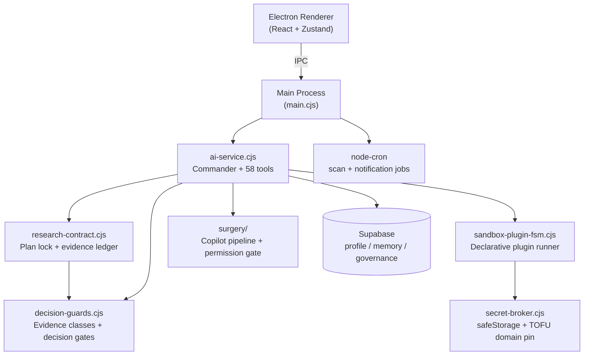

# 🐺 ÇAKAL — Evidence-Gated AI Investment Research Agent

<p align="center">
  
</p>

<p align="center">
  <a href="https://github.com/emrahbadas/CAKAL/actions/workflows/ci.yml"></a>
  <a href="LICENSE"></a>
  
  
  <a href="README.tr.md"></a>
</p>

**A single-user desktop AI financial research assistant for Borsa Istanbul (BIST), equities, FX, gold, crypto, real estate and e-commerce opportunity discovery.**

ÇAKAL researches markets from multiple sources and weighs technicals, fundamentals, news flow and risk together — but it will not decide for you, and it cannot execute a financial transaction. Its distinguishing feature is a **deterministic evidence gate**: the agent may not emit a BUY/SELL verdict unless real tools actually produced fresh, entity-matched evidence for that specific claim.

That is not a line in a system prompt the model can talk its way around. It is a machine-checked contract.

> It hunts for opportunity, but never mistakes a scent for evidence.

🇹🇷 **[Türkçe README](README.tr.md)** — the full documentation, product philosophy and architecture notes are written in Turkish. The application UI is Turkish; the code and identifiers are English.

<!-- DEMO: 15-25s GIF goes here (docs/assets/cakal-demo.gif).
     Suggested take: "compare BRSAN and MEYSU" -> research plan locks ->
     tools run -> evidence coverage panel -> verdict lands on İZLE / RİSKLİ. -->

---

## Why ÇAKAL?

Most AI finance assistants produce an answer first and justify it afterwards. ÇAKAL reverses the order: it declares what evidence the question requires, collects it, records provenance, and lets deterministic guards decide how strong a verdict the evidence can support.

- **Evidence-gated verdicts.** No fresh, sourced, entity-matched measurement → no BUY/SELL. The fallback is REVIEW / WATCH / RISKY / INSUFFICIENT DATA, not a confident guess.
- **Auditable research contracts.** For complex questions the plan is locked *before* any evidence tool runs, and completion is computed from an evidence ledger — not from what the model says it did.
- **Provenance over assertion.** Saying "I measured it" is not measuring. Every guard inspects real tool output: which tool, for which ticker, which evidence class, at what time.
- **Partial degradation, not refusal.** A missing layer does not discard the research; it downgrades the claims that depended on that layer and keeps the rest, labelled.
- **BIST-focused analysis.** Live board coverage, sector-aware financial statement adapters (industrial / bank / insurance / holding / REIT), valuation inputs, earnings-vs-price positioning.
- **Sandboxed self-evolution.** The agent can notice a missing capability and propose a new declarative plugin — but it cannot execute arbitrary code, and it cannot operate on its own core.
- **Source-code surgery behind a permission gate.** Code changes are delegated to a separate pipeline with a hard-block layer and a user-confirmation layer; chat text never counts as a merge approval.

### Three ideas that transfer beyond finance

If you are building agents in another domain, these are the reusable parts:

1. **Check evidence classes, not tool names.** A guard that asks "did `get_price` run?" is trivially satisfied. Ours asks "does a `CURRENT_EQUITY_PRICE` measurement exist, for *this* entity, inside its TTL?" A blocked call that returned `success: true` proves nothing.
2. **Lock the bar, free the path.** Required evidence is fixed at plan time; the route to it is not. A dead source can be replaced by amendment — but the bar can never be lowered mid-run.
3. **Degrade the verdict, keep the finding.** Refusing to answer wastes real work. Neutralising only the claims that lost their support keeps the answer useful and honest at the same time.

---

## How the evidence gate works

```
Complex request → submit_research_plan (LOCKED)
   → collect evidence → compute coverage from the ledger
   → if incomplete: ONE targeted repair (name the tool that produces the class)
   → per sub-question: COMPLETE / PARTIAL / BLOCKED
```

Every tool execution writes a structured record, kept entirely separate from performance timing — one tracks speed, the other tracks epistemic state:

```
{ researchRunId, tool, entity, evidenceClass, asOf, retrievedAt, universeScope }
```

- **Entity dimension is mandatory.** A price fetched for THYAO does not satisfy a sub-question about KCHOL.
- **TTL per class.** Price 15 min, technicals 1 hour, financial statements 90 days. One freshness rule cannot serve every kind of evidence.
- **Scope is one user request.** Repair turns share the plan and ledger; a new request opens a new run, so old evidence cannot quietly satisfy a new question.

Sub-questions are typed by output kind, because "blue chip" and "buyable today" are different questions and a company may pass one and fail the other:

| outputKind | Minimum required evidence |
|---|---|
| `structural_leader` | index membership + liquidity |
| `current_leader` | current price + technical signal |
| `investable_candidate` | fundamentals + **valuation** + price + market session |

Raw financial statements (`FUNDAMENTALS`) are **not** valuation (`VALUATION`). They are separate classes with separate producers.

Full detail — including the research contract rules, evidence ledger semantics, decision guards and the governance chain — is in the [Turkish README](README.tr.md).

---

## Quick start

```bash
git clone https://github.com/emrahbadas/CAKAL.git
cd CAKAL
npm install
cp .env.example .env    # OpenAI, Perplexity, Supabase, Telegram keys
npm test                # 977 unit tests (75 files)
cd apps/desktop && npm run dev
```

Requires Node 20+. Model inference goes to the OpenAI and Perplexity APIs, and persistence uses Supabase — this is a local desktop application, not a local-inference one. Infrastructure keys live in `.env`; plugin keys live in the encrypted in-app **Secret Broker**.

---

## Architecture



There is **one** agent — a Commander that routes by task type and calls tools. The research contract, the guards and the funnel are deterministic modules, not additional agents. *The strategist thinks; the contract locks what it thought.*

### Financial data sources

| Source | What it provides | Note |
|---|---|---|
| Mynet live board (`get_bist_board`) | Whole board in one request (Aug 2026 measurement: 628 instruments): price, % change, volume, turnover, XU030/XU050/XU100 **membership**, session state | Delayed. Membership is not weight |
| Yahoo Finance | Technical series: moving averages, multi-period returns, volatility | `dailyChangePercent` is window-independent; `volatility` is stdev of daily returns |
| İş Yatırım MaliTablo | Balance sheet + income statement; sector adapters | Sector is decided by materiality, not by a line item's presence |
| `get_valuation_multiples` | Valuation inputs (net profit, equity, current price, period) | Sole producer of the `VALUATION` class |
| Perplexity (`verify_claim`) | Supporting / refuting / expert evidence | Deduplicated by domain; source count ≠ claim confidence |

**Market session is an evidence class.** Sessions are computed in Europe/Istanbul, because the machine clock is not the exchange clock. Public holidays are not asserted without a verified calendar — the wording is "the next open BIST session".

---

## Security model

| Layer | Rule |
|---|---|
| Write surface | `.cakal-sandbox/` only; core directories are closed to the LLM |
| Code execution | None. Plugins are declarative HTTPS GET manifests |
| Secrets | Encrypted via safeStorage; never enter LLM context; **TOFU domain pin** per key |
| HTTP | Redirects not followed, response size capped, local/private hosts blocked |
| Commands | Allowlist + blocklist; chaining and eval patterns blocked |
| Financial verdicts | Deterministic decision lock; the gate inspects evidence **class** and age, not tool names |
| Price levels | A concrete entry/stop number passes only if a measurement exists for that symbol |
| Source code | The LLM cannot write it; requests go to the surgery pipeline, and a preflight BLOCK cannot be overridden by user approval |

---

## Project structure

```
apps/desktop/
  electron/          # Main process: agent, guards, FSM, Secret Broker
    research-contract.cjs   # Plan lock, evidence ledger, targeted repair
    decision-guards.cjs     # Evidence classes, TTL, decision gates
    execution-contract.cjs  # Plan-verify loop for code tasks
    earnings-pricing.cjs    # Earnings-price bridge (price extension measurement)
    candidate-funnel.cjs    # Candidate funnel contract (stage grammar, lineage)
    surgery/                # Copilot surgery pipeline + permission gate
  src/               # React renderer: Chat, Dashboard, Settings, Voice
packages/            # Shared core (e.g. investment-research policy-core)
supabase/            # Schema migrations
tests/               # Vitest unit tests (security paths included)
docs/                # Audit and API notes
```

## Roadmap

Open work and changes **awaiting live verification**: [docs/acik-isler-ve-dogrulama.md](docs/acik-isler-ve-dogrulama.md). The annotated roadmap — deterministic candidate funnel, source authority tiering, level derivation — is in the [Turkish README](README.tr.md).

## License

[Business Source License 1.1](LICENSE) — converts to **MIT** on 2030-01-01.

Copying, modification, derivative works and non-production use are granted unconditionally. Conditions apply only to **Production Use**: single-user deployment, no financial execution (absolute — user confirmation does not lift it), the safety controls in [SECURITY_BOUNDARIES.md](SECURITY_BOUNDARIES.md) must remain operational, and modified deployments must state *"Derived from ÇAKAL — this is not an official version."*

The name is not covered by the code license — see [TRADEMARKS.md](TRADEMARKS.md). Commercial licensing: emrahbadas@gmail.com

> Not reviewed by a lawyer. Independent legal review is advisable before commercial release.

---

*Design and product owner: Emrah Badaş — ocean-going ship captain.*
