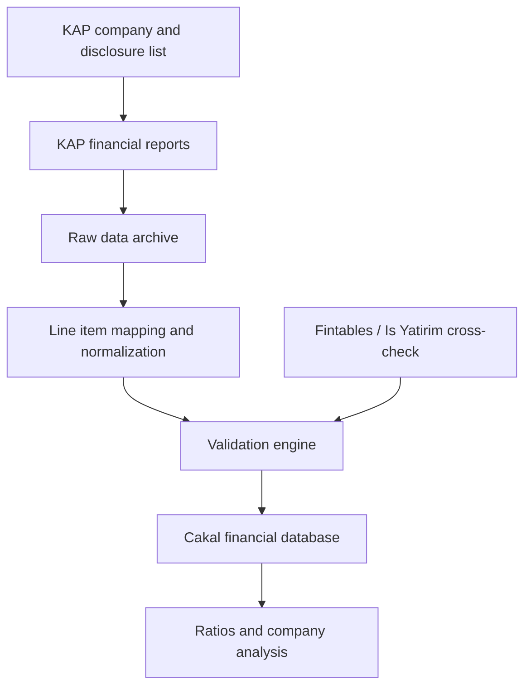

# Cakal Investment Workflow Audit

Date: 2026-07-18 (updated 2026-07-19: policy-core single source, real FSM, capability allowlist, graduated freshness gate, duplicate-source detection, assumed-mandate protection, dynamic BIST universe)

## Current State

- Language/framework: TypeScript workspaces with a React/Electron desktop app and CommonJS Electron runtime helpers.
- Existing finance behavior: `FinanceWatcherAgent` and `deterministic-agents.cjs` produce short-term market signals, volatility checks and simple suitability notes.
- Existing FSM/policy: finance has risk and commander decision guards, but no dedicated investment research state machine.
- Existing tool registry: `ai-service.cjs` exposes market data, web search, claim verification, YouTube insights, watchlists and chart tools.
- Existing memory: user profile and watchlists exist, but prior candidates can still influence finance behavior unless a policy explicitly blocks them.
- Existing audit/logging: strategy memory and evolution logs exist; investment research now has append-only audit tables and DB adapters.
- Financial ingestion: KAP company/disclosure/report/raw item/normalized fact/validation/cross-check/ratio tables are defined in a second migration.
- KAP cache policy: current report pointers and adaptive sync state are defined in `20260719000100_kap_cache_policy.sql`.
- Database impact: `20260718000100_investment_research_audit.sql`, `20260718000200_financial_ingestion_pipeline.sql` and `20260719000100_kap_cache_policy.sql` are applied on the remote Supabase project and marked as applied in migration history.

## Gap

The missing layer is not another prompt. The missing layer is an investment research discipline that controls order, evidence quality and final decision eligibility.

The highest-risk shortcut is:

1. User asks for a fresh market scan.
2. System starts from memory, watchlist or recent gainers.
3. System emits a persuasive answer before universe, evidence, valuation, risks and counter thesis are complete.

## Implemented Direction

This pass adds a typed investment research domain under `packages/core/investment-research`.

It introduces:

- Research modes such as `FRESH_MARKET_SCAN`, `COMPANY_DEEP_DIVE`, `WATCHLIST_REFRESH` and `PORTFOLIO_FIT`.
- Versioned policy files for base rules, fresh market scan and watchlist refresh.
- Deterministic required states for research workflow validation.
- Claim and evidence models with source tiers.
- Financial metric metadata requirements.
- Valuation and scenario validation.
- Counter thesis gate.
- Suitability separated from security quality.
- Decision records that include policy version and gate results.

## KAP Financial Pipeline

The requested flowchart is implemented as a deterministic financial ingestion layer:

Code entry points:

- `archiveKapFinancialReport`
- `normalizeKapFinancialLineItems`
- `deriveQuarterlyFactsFromCumulative`
- `validateFinancialStatementSet`
- `crossCheckFinancialFacts`
- `calculateFinancialRatios`
- `createCompanyAnalysisSnapshot`
- `evaluateKapCache`
- `calculateNextKapCheckAt`
- `calculateKapErrorRetryAfter`
- `planVersionedKapReport`

Source adapter:

- `packages/sources/kap/src/index.ts`
- Uses KAP public web endpoints for company search, BIST company list, disclosure subjects and financial disclosure list checks.
- The adapter checks the lightweight disclosure list first; full report page parsing is available but should only be called when the cache policy says `FETCH_NEW_REPORT`.
- `packages/sources/mkk-vyk/src/index.ts` is added as the official MKK KAP VYK API adapter. Because the free plan is limited to 6 calls/minute, it must be used through cache/sync jobs, not per user query.

Sync orchestration:

- `scripts/kap-sync-worker.cjs`
- `scripts/run-kap-sync-once.cjs`
- `scripts/kap-sync-scheduler.cjs`
- `scripts/reparse-kap-current-report.cjs`
- `scripts/process-kap-financial-analysis.cjs`
- Reads due symbols from `kap_sync_state` or accepts explicit symbols from the command line.
- Uses `kap_current_financial_reports` plus `kap_sync_state` before touching KAP.
- Fetches only the KAP disclosure list when a check is due.
- Downloads and archives the full report only when a new disclosure id appears or a fresh sync is explicitly requested.
- Writes append-only report versions, raw financial items, current report pointer and adaptive sync state.
- Can run continuously through `kap:sync-scheduler` when Edge Function is not preferred.
- On this Windows workstation, `CakalKapFinancialSync` is installed through Windows Task Scheduler and runs `kap:sync-once -- --limit=25` every 30 minutes while the user is logged in.
- Scheduler logs are written under `logs/kap-sync-task/` and the latest manual verification returned `LastTaskResult=0`.
- Can reparse a current report into a new append-only parser-correction version when the raw parser improves.
- Runs KAP financial analysis processing after a newly archived report: raw items -> normalized facts -> validation -> ratios -> company analysis snapshot.

Validation gates include:

- Balance sheet equation: assets = liabilities + equity.
- Cash reconciliation: beginning cash + net cash change = ending cash.
- Consolidated vs solo basis mixing.
- Mixed period/report/currency detection.
- Low-confidence mapping warnings.
- Secondary provider value mismatch detection.

## KAP Cache Policy

KAP financial data is stored indefinitely. `next_check_at` is not a deletion/expiry date; it is the next time Cakal should check whether KAP has a newer disclosure.

Runtime decision order:

1. Read `kap_current_financial_reports` and `kap_sync_state`.
2. If `next_check_at` is in the future, use DB data.
3. If check time arrived, check only the KAP disclosure list.
4. If disclosure id is unchanged, update sync state and avoid downloading the full report again.
5. If disclosure id changed, fetch the report, validate/normalize it, save a new version, and move the current pointer.
6. If KAP fails, set `retry_after` with exponential backoff and keep using DB data as partial research.

Cache intervals:

- Financial report normal period: 24-72 hours adaptive check.
- Reporting season or expected report window: around 6 hours.
- First 24 hours after a new report: around 2 hours for correction/restatement checks.
- Special disclosures: 15-60 minutes when implemented as a live adapter.
- MKK VYK API safety interval: at least 12 seconds between calls by default, equivalent to 5 calls/minute.

## User Research Defaults

- Supported market: BIST.
- Sector: ask the user when missing; if the user does not specify, scan the broad BIST universe.
- Horizon: ask the user when missing; if missing, use 12-24 months / 18 months as a working assumption.
- Risk: infer from user profile, max drawdown and liquidity need; default to medium risk when profile data is insufficient.
- Risk override: if the user explicitly asks for a higher/lower risk level, run research with that risk setting and disclose it.
- Data provider policy: free/public sources first. Paid or pay-as-you-go data providers require explicit user approval after cost review.

## 2026-07-19 Hardening Pass

Single source of truth:

- `packages/core/investment-research/shared/policy-core.cjs` now holds research modes, mode detection, per-mode required states, forbidden shortcuts, the FSM transition table, state capability allowlists, graduated freshness rules and mandate-critical field definitions.
- The TypeScript package derives its policy registry and mode detection from policy-core; `apps/desktop/electron/deterministic-agents.cjs` requires the same file (with an inline fallback only for packaged-app path failures).
- `tests/investment-research-policy-core.test.mjs` asserts TS/CJS behavioral equivalence so silent drift fails CI.

Real state machine:

- New states: `INTAKE`, `MODE_SELECTED`, `MANDATE_CHECK`, `UNIVERSE_BUILDING`, `COMPLETED`, `BLOCKED`, `FAILED`.
- `createResearchStateMachine` enforces the transition table up front (invalid transitions are rejected, not just flagged later), tracks retry limits per state (`RETRYABLE_STATES`, exhaustion moves to `FAILED`), supports block/unblock, and appends an audit event on every transition.
- `evaluateResearchWorkflow` accepts an optional `stateHistory` and blocks on sequence violations (`STATE_SEQUENCE_GATE`).

Capability allowlist per state:

- `STATE_CAPABILITIES` defines capabilities (not tool names) per state. `REPORT_READY` can only read the verified research record; web search, market data and new-claim capabilities are denied there. The Electron workflow policy blocks `capabilityRequests` violations.

Data integrity gates:

- `DATA_FRESHNESS_GATE` (graduated): stale `MARKET_PRICE`/`FX_RATE`/`MARKET_CAP` hard-block; stale `FINANCIAL_STATEMENT` blocks only when a newer version is known; `HISTORICAL_SERIES` is exempt; uncategorized stale data blocks HIGH/CRITICAL claims and warns otherwise.
- Duplicate-source detection: evidence is grouped into source families via `contentHash` or normalized publisher/title; copies of the same story no longer count as independent confirmation for HIGH/CRITICAL facts.
- Assumed-mandate protection: `buildResearchMandateGuidance` records `assumedFields`; a mandate whose risk/horizon/drawdown came from system defaults is not "complete", so default assumptions can never unlock personalized AL/SAT (fixes the medium-risk-default vs mandate-gate contradiction).
- `ResearchCharter` now carries `nullHypothesis`.

Dynamic universe:

- `runLiveInvestmentResearchScan` builds the universe from the live KAP BIST company list (24h cached) instead of the hardcoded 45-symbol list; known-liquid names are only a scan-priority, not a universe filter. On KAP failure it falls back to the static list and reports `STATIC_FALLBACK` provenance plus an explicit policy warning that results cannot be presented as a full market scan. Universe snapshots record `source`, `sourceDetail`, `universeTotalCount` and `scannedCount`.

Deliberately deferred (engine before dashboard): 19-section Report Composer, live ThesisMonitor runtime, separate Red Team LLM session, MNPI classification layer.

## Known Limits

- Live KAP endpoint scraping/downloading is intentionally isolated from the core pipeline. The KAP source adapter and sync worker feed the core database without weakening the investment workflow gates.
- One-shot, local long-running KAP sync orchestration and Windows Task Scheduler orchestration exist. Supabase Edge Function cron or an always-on server process is still optional if the sync must run while this workstation is offline.
- Synced KAP raw rows are archived and current report pointers are maintained. Normalization, validation, ratios and company analysis snapshots now run automatically for newly archived reports and can be run manually for current reports.
- Default industrial line-item mappings were expanded to `kap-industrial-default-v2`; mapping coverage can now be measured against the current report pointer before broad BIST rollout.
- It does not create broker/trade execution; investment decisions remain research outputs only.
- It does not yet isolate Red Team execution in a separate LLM/tool session; it enforces the presence and evidence linkage of a counter thesis.

## Next Step

Broaden provider-specific and sector-specific financial mapping sets beyond the industrial default, starting from the highest-frequency unmapped labels reported by `kap:mapping-coverage`.

## Operational Commands

- Check whether DB audit tables exist:
  `npm run db:check-investment-research`
- Run a live BIST pre-screening smoke test:
  `npm run research:scan-smoke`
- Investment research audit migration:
  `supabase/migrations/20260718000100_investment_research_audit.sql`
- Financial ingestion migration:
  `supabase/migrations/20260718000200_financial_ingestion_pipeline.sql`
- KAP cache policy migration:
  `supabase/migrations/20260719000100_kap_cache_policy.sql`
- Check whether financial ingestion DB tables exist:
  `npm run db:check-financial-ingestion`
- Run a live KAP disclosure-list smoke test:
  `npm run kap:smoke -- THYAO`
- Run one KAP cache sync for explicit symbols:
  `npm run kap:sync-once -- THYAO`
- Force a fresh KAP check for an explicit symbol:
  `npm run kap:sync-once -- THYAO fresh`
- Run due KAP sync rows from `kap_sync_state`:
  `npm run kap:sync-once -- --limit=25`
- Run local continuous KAP sync scheduling:
  `npm run kap:sync-scheduler -- --interval-minutes=30 --limit=25`
- Install Windows Task Scheduler KAP sync:
  `npm run kap:scheduler:install-win`
- Remove Windows Task Scheduler KAP sync:
  `npm run kap:scheduler:uninstall-win`
- Reparse the current archived KAP report with the latest parser:
  `npm run kap:reparse-current -- THYAO`
- Process normalized financial analysis for current KAP reports:
  `npm run kap:process-analysis -- THYAO`
- Force a new append-only validation/ratio/snapshot for a current KAP report:
  `npm run kap:process-analysis -- THYAO force`
- Measure KAP mapping coverage for current reports:
  `npm run kap:mapping-coverage -- THYAO`
